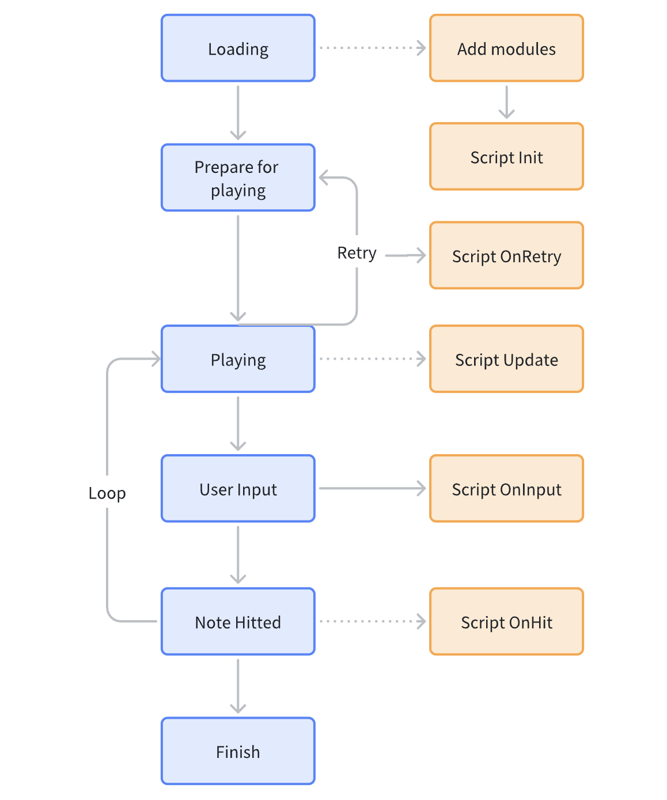

# Skin Script API Reference

## Usage

Since MalodyV 5.3.0, the skin system supports using scripts to achieve the following functions:

1. Dynamically modify all properties of module (such as dynamically calculating size, position, etc. based on device properties) before playing. Set animations for the module.
2. Dynamically modify the properties of module at every frame throughout the playing.
3. Dynamically modify the properties of the module when player hits notes.

## Data

### Module

In the skin, each individual object is called a module, which contains all the attributes including image, size, position, color, etc. Module objects are referred to as module in the parameters and return values of the API .

### Animation

In the script, we use a struct list below to describe module animations:

```lua
{
    start = 1000,  -- start time in ms(refer to audio time)
    finish = 2000,  -- finish time in ms
    from = 50,  -- property value before animate
    to = 100, -- property value after animated
    repeats = 2,  -- how many time should the animation repeats, 0 means no repeat, Optional
    repeatType = 1,  -- repeat type, see below
    delay = 0, -- wait time before repeat, optional, added in 5.3.2
    ease = 1, -- transition type, see below
    custom = {p1=1,p2=0,p3=1,p4=-0.77}  -- custom transition, Optional
}
```

### Custom Transition

If you do not use the built-in transition, you can set the custom value yourself. Custom transition requires 4 values. It is recommended to use the online tool: [http://cubic-bezier.com/](http://cubic-bezier.com/) debug the desired effect, and then copy the value output by the tool to the p1~ p4 parameters.

The structure is as follows:

```lua
{p1=1,p2=0,p3=1,p4=-0.77}
```

### BPM

A BPM record that contains the start time and BPM value, the structure is as follows:

```lua
{
    time = 0,
    bpm = 160
}
```

## Script Template

```lua
-- before playing, called only once during playing
function Init()
end

-- every frame. Remove if empty
function Update()
end

-- player hit notes. Remove if empty
-- Ignored in composer preview
function OnHit()
end

-- player press key or touch screen. Remove if empty
-- Ignored in composer preview
function OnInput()
end
```

## API Reference

The following APIs are supported starting from 5.3.0

### Module Management API
> Example：local light = Module:Find("light")

| Function name                           | Definition                                                                               | Remarks                                                                                                       |
| --------------------------------------- | ---------------------------------------------------------------------------------------- | ------------------------------------------------------------------------------------------------------------- |
| Find(string): module                    | Find module reference, using module name on the composer panel as parameter              |                                                                                                               |
| [+ 5.3.4 +] Clone(module, string): module | Passing module and new name to clone an exist module                                     | Only can be used in Init(). Access to the new module by Find() in other functions. Return itself in Composer. |
| [+ 5.3.4 +] Shadow(module, int): module   | Create a shadow of an existing module, with the lifetime(in ms) the new module can exist | Can be used anywhere. Used for particle effect.Return itself in Composer.                                     |
| [+ 5.4.0 +] GetString(string): string     | Access predefined string values in Composer                                              | Return empty as default                                                                                       |
| [+ 5.4.0 +] GetNumber(string): float      | Access predefined number values in Composer                                              | Return 0 as default                                                                                           |
| [+ 5.4.0 +] GetBool(string): bool         | Access predefined boolean values in Composer                                             | Return false as default                                                                                       |

### Module Property
> Example：light.X = 100

| Property name    | Definition                                                                               | Remarks               |
| ---------------- | ---------------------------------------------------------------------------------------- | --------------------- |
| X                | Unit value of X coordinate                                                               |                       |
| Y                | Unit value of Y coordinate                                                               |                       |
| Width            | Unit value of width                                                                      |                       |
| Height           | Unit value of height                                                                     |                       |
| Rotate           | Rotation angle around the Z axis (refer to screen plane), positive value means clockwise | int                   |
| RotateX          | The value of rotation around the X axis                                                  | int                   |
| RotateY          | Value of rotation around the Y axis                                                      | int                   |
| Alpha            | Transparency, value 0-100                                                                | int                   |
| Text             | Text                                                                                     | Only for text modules |
| [+ 5.3.4 +] ScaleX | Scale of width                                                                           |                       |
| [+ 5.3.4 +] ScaleY | Scale of Height                                                                          |                       |
| [+ 6.0.0 +] Scale  | Scale of both Width and Height                                                           |                       |
| [+ 6.2.2 +] Value  | Value of mask image      |                       |

### Module API
> Example：light:DoMoveX({start=1000, end=2000, from=0, to=100})

| Function name                                | Definition                                                 | Remarks                                                                                                                 |
| -------------------------------------------- | ---------------------------------------------------------- | ----------------------------------------------------------------------------------------------------------------------- |
| Play()                                       | Used to frame modules, play from start                     |                                                                                                                         |
| Stop()                                       | Used for frame modules, stop playback, back to first frame | Use Alpha = 0 to hide the module                                                                                        |
| DoMove(animate, animate):id                  | Add movement animation                                     | The api needs two parameters, one for x and one for y. For the second one, values are ignored except from & to          |
| DoMoveX(animate):id                          | Add horizontal movement animation                          |                                                                                                                         |
| DoMoveY(animate):id                          | Add vertical movement animation                            |                                                                                                                         |
| DoResize(animate, animate):id                | Add size change animation                                  | The api needs two parameters, one for width and one for height. For the second one, values are ignored except from & to |
| DoWidth(animate):id                          | Add width change animation                                 |                                                                                                                         |
| DoHeight(animate):id                         | Add height change animation                                |                                                                                                                         |
| DoAlpha(animate):id                          | Add transparency changing animation                        |                                                                                                                         |
| DoRotate(animate):id                         | Add rotation animation                                     |                                                                                                                         |
| [+ 6.0.0 +] DoRotateX(animate):id              | Add rotation by X animation                                |                                                                                                                         |
| [+ 6.0.0 +] DoRotateY(animate):id              | Add rotation by Y animation                                |                                                                                                                         |
| [+ 5.3.4 +] DoScale(animate, animate):id       | Add scale animation                                        |                                                                                                                         |
| [+ 5.3.4 +] DoScaleX(animate):id               | Add width scale animation                                  |                                                                                                                         |
| [+ 5.3.4 +] DoScaleY(animate):id               | Add height scale animation                                 |                                                                                                                         |
| [+ 5.3.4 +] SetColor(r, g, b)                  | Set color, rgb range from 0 to 255                         |                                                                                                                         |
| [+ 5.4.62 +] CancelAnimate(id)                 | Cancel the given animation                                 |                                                                                                                         |
| [+ 6.0.0 +] SetSlice(left, top, right, bottom) | Set the 9-patches value of image                           |                                                                                                                         |

### Hit Event API
> Example：local hit = Game:HitEvent()
> hit:JudgeResult()

| Function name                    | Definition                                                                                                                                                                                 | Remarks                                                              |
| -------------------------------- | ------------------------------------------------------------------------------------------------------------------------------------------------------------------------------------------ | -------------------------------------------------------------------- |
| JudgeResult(): int               | Hit result, meaning of return values see below                                                                                                                                             |                                                                      |
| Offset(): int                    | Offset between note time and hitted time                                                                                                                                                   | Positive numbers are hitted early. Negative numbers are hitted late. |
| HitX(): int                      | X coordinate of the hitted Note                                                                                                                                                            |                                                                      |
| [+ 5.3.2 +] NoteTime(): int        | Note time of the hitted note                                                                                                                                                               |                                                                      |
| [+ 5.3.2 +] NoteWidth(): int       | Note width of the hitted note                                                                                                                                                              | Return 0 if not in Slide mode                                        |
| [+ 5.3.4 +] NoteType(): int        | Note type of the hitted note                                                                                                                                                               | See enums value below                                                |
| [+ 5.4.32 +] NoteInfo(string): int | Get Additional Notes information<br>----<br> Arrow：Note Arrow Direction<br>[+ 5.4.52 +] Hit: Hit count of Taiko Renda/Balloon notes<br> [+ 5.4.52 +] Remain: Remain hit count of Taiko Renda/Balloon notes | Parameters are case insensitive                                      |

### Input Event API
> Example：local hit = Game:InputEvent()
> hit:HitX()

| Function name           | Definition                                                                                              | Remarks                                            |
| ----------------------- | ------------------------------------------------------------------------------------------------------- | -------------------------------------------------- |
| [+ 5.3.2 +] HitX(): int   | X coordinate or X mapping of the event                                                                  | Return -1 if players hit outside of the play area. |
| [+ 6.0.0 +] HitY(): int   | Y coordinate or the event                                                                               |                                                    |
| [+ 5.3.2 +] Type(): int   | Input type, see enums                                                                                   |                                                    |
| [+ 5.3.4 +] Source(): int | Input source, which refers to touch finger in most cases.  The same source value means the same finger. | -1 means hit by keyboard.                          |

### Audio API
> Example: Audio:Load("hit.ogg")

| Function Name             | Definition                                                                                               | Remarks                             |
| ------------------------- | -------------------------------------------------------------------------------------------------------- | ----------------------------------- |
| [+ 6.0.0 +] Load(name): res | Load audio resource within skin folder and get the resource id:res                                       | Audio format supported: mp3,ogg,wav |
| [+ 6.0.0 +] Play(res, vol)  | Play the audio with the specified resource id, and set the volume<br>---<br>res: resource idvol: volume, [0-100] |                                     |

### Game API
> Example:  local w = Game:Width()

| Function name                              | Definition                                                                                                                                                                                     | Remarks                                                                                                                         |
| ------------------------------------------ | ---------------------------------------------------------------------------------------------------------------------------------------------------------------------------------------------- | ------------------------------------------------------------------------------------------------------------------------------- |
| AudioLength(): int                         | Get the total music duration in milliseconds                                                                                                                                                   | Return 60000 in Composer                                                                                                        |
| Time(): int                                | Gets the current audio time in milliseconds                                                                                                                                                    | Simulation in Composer from 0-60000 ms                                                                                          |
| HitEvent(): hit                            | Get the currently triggered hit event                                                                                                                                                          | Return null in Composer                                                                                                         |
| Width():int                                | Game window width, return unit value                                                                                                                                                           |                                                                                                                                 |
| Height(): int                              | Game window height, return unit value                                                                                                                                                          | At present, it returns 1080 as default                                                                                          |
| [- 5.4.62 -] TrackAngle(): int               | Get Key Track Angle                                                                                                                                                                            | Only Key and Slide modes are available, 0 is returned for other modes, and 0 is also returned when the 3D track is not enabled. |
| [+ 5.3.1 +] StartTime(): int                 | Time of the first Note                                                                                                                                                                         | Return 1000 in Composer                                                                                                         |
| [+ 5.3.1 +] BpmCount(): int                  | Get the number of bpm records                                                                                                                                                                  | Return 1 in Composer                                                                                                            |
| [+ 5.3.1 +] BpmAt(int): bpm                  | Gets the bpm record at the specified index                                                                                                                                                     | The index ranges from 0 to BpmCount-1, and returns bpm = 160 in Composer.                                                       |
| [+ 5.3.2 +] InputEvent(): input              | Get the currently triggered input event                                                                                                                                                        | Return null in Composer                                                                                                         |
| [+ 5.3.4 +] [- 5.4.62 -] SceneScale(): float   | Get Scene Scale                                                                                                                                                                                | Same as Scene Scale in play settings                                                                                            |
| [+ 5.4.0 +] IsVersionGE(int, int, int): bool | Is the current version greater than or equal to the specified version                                                                                                                          |                                                                                                                                 |
| [+ 5.4.32 +] ChartInfo(string): string       | Get Chart information<br>----<br> Version: string<br> Creator: string<br> Title: string<br> Artist: string<br> Bpm: number<br> Level: number<br> [+ 5.4.52 +] Key: number, key tracks<br> [+ 5.4.52 +] Note: number, note count | Parameters are case insensitiveReturn empty in Composer                                                                         |
| [+ 5.4.62 +] FieldMeta(string): number       | Get the field setting values (Same as value from composer information)<br>----<br> Angle: Key Track Angle<br> Scale: Scene Scale<br> Judge: Judge Position<br> JudgeY: Taiko Judge Height                       |                                                                                                                                 |
| [+ 5.4.62 +] SetFieldMeta(string, number)    | Set field setting value                                                                                                                                                                        | If the value is locked from composer information, the call will be invalid                                                      |
| [+ 6.0.0 +] ReadFile(name): string           | Read file from skin or chart folder                                                                                                                                                            | Find file in skin folder first, then chart folder.                                                                              |
| [+ 6.0.0 +] Language(): int                  | Get current system language                                                                                                                                                                    | See Enums - Language                                                                                                            |
| [+ 6.0.42 +]ReadBytes(name):array | Read binary content from file in skin or chart folder  | |

## Enums

### Transition

Normal = 0

Ease In = 1

Ease Out = 2

### Repeat Type

Normal = 0，from > to, from > to

Round = 1，from > to > from > to

### Hit Judge Result

Ignore = 0

Best = 1

Cool = 2

Good = 3

Miss = 4

Flick = 5

[+ 5.3.1 +] Hold Combo = 6

[+ 5.3.4 +] Wipe = 7

[+ 5.4.6 +] Combo Break = 8

[+ 5.4.40 +] Taiko Big Hit Best = 9

[+ 5.4.40 +] Taiko Big Hit Cool = 10

[+ 5.4.40 +] Taiko Renda = 11

[+ 5.4.40 +] Taiko Balloon Hit = 12

[+ 5.4.40 +] Taiko Balloon Pop = 13

### Input Type

Down = 1

Move = 2

Up = 3

### Note Type

Tap = 1

Hold = 2

Rain = 3

Wipe = 4

Flick(Tap) = 5

Flick(Wipe) = 6

Slide = 7

[+ 5.4.40 +] Taiko Don = 8

[+ 5.4.40 +] Taiko Big Don = 9

[+ 5.4.40 +] Taiko Ka = 10

[+ 5.4.40 +] Taiko Big Ka = 11

[+ 5.4.40 +] Taiko Renda = 12

[+ 5.4.40 +] Taiko Big Renda = 13

[+ 5.4.40 +] Taiko Balloon = 14
[+ 6.0.0 +]Osu Slider = 15
[+ 6.0.0 +]Osu Spinner = 16

### Note Arrow Direction

Left = 1

Up = 2

Right = 3

### Language

0 = English

1 = 简体中文(Chinese Simplified)

2 = 繁體中文(Chinese Traditional)

3 = 日本語 (Japanese)

4 = Español(Spanish)

5 = Deutsch(German)

6 = ไทย(Thai)

7 = Русский(Russian)

8 = Français(French)

9 = 한국어(Korean)

10 = Български(Bulgarian)

11 = Bahasa indonesia(Indonesian)

12 = Italiano(Italian)

13 = Tiếng Việt(Vietnamese)

14 = Українська(Ukrainian)

## Demo

```lua
function Init()
    local marlo = Module:Find(marlo)
    -- Add animation to module
    local ease = {p1=1,p2=0,p3=1,p4=-0.77}
    marlo:DoMove({start=1000, finish=2000, from=100, to=200, custom=ease})
    marlo:DoAlpha({start=1000, finish=2000, to=100}) -- from is ignored, default to 0
end

function Update()
    local time = Game:AudioTime()
    local marlo = Module:Find(marlo)
    marlo.Alpha = time / Game:AudioLength()
end
    
function OnHit()
    local evt = Game:HitEvent()
    local judge = evt:JudgeResult()
   
    if (judge == 0) then
        local judge_text = Module:Find(judge-1)
        judge_text:Play()
    elseif (judge == 1) then
        local judge_text = Module:Find(judge-2)
        judge_text:Play()
    elseif (judge == 2) then
        local judge_text = Module:Find(judge-3)
        judge_text:Play()
    else
        local judge_text = Module:Find(judge-4)
        judge_text:Play()
    end
end
```
