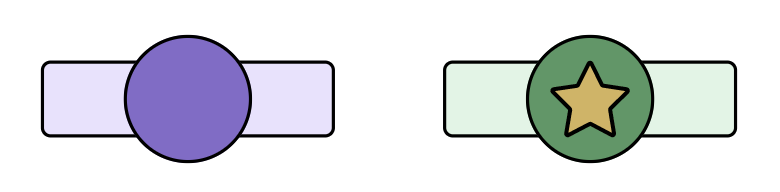
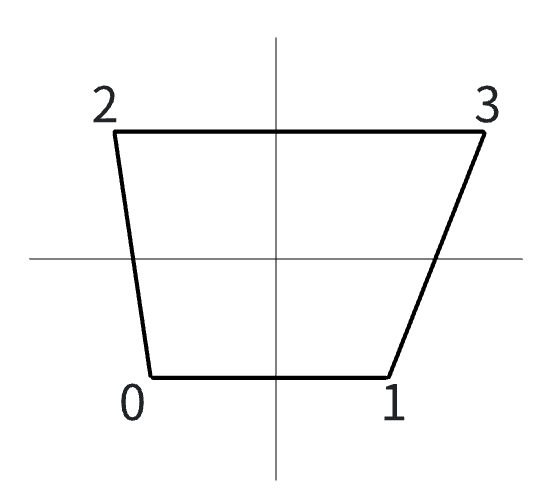

# Skin Script API for Free Mode
> Assuming the reader already understands the skin script basics, free mode fully inherits the functionality of the basic mode

## Usage Cases
Since MalodyV 6.0.0, the skin system supports free mode:
1. The script controls the appearance of each note.
2. The script controls the movement of each note.
3. The script controls each input event, judgments, and scoring.

## Data Structures
### NoteInfo
Note data, also called info, with the following structure:
```lua
{
    nid = 0,  -- note id，unique
    type = 0,  -- See enums - Note type
    time = 160,  -- time for judgement
    endtime = 200,  -- end time for hold notes
    width = 40,
    arrow = 0,  -- See enums - Note arrow
    x = 1, -- Note position x，start from 1
    segments = list -- slide segments，
}

-- slide segments data
{
    x = 1,   -- x offset related to main x
    time = 233  --time offset related to main time
}
```

### List
List objects are different from Lua arrays, demos as follows:
```lua
-- Get length
list.Length
-- Get the first element
list[0]
```

## Script template
```lua
-- Called when initializing skins, returns true/false to indicate whether or not the current chart is supported for playing with skins
-- Optional, if filtering is not needed, do not declare the function
function CanPlay()
end

-- After all the notes have been parsed, this function can be used to check all the notes and add virtual notes
-- Optional, if the processing is not needed, do not declare the function
function OnProcessNote()
end

-- Called before Note is about to appear
-- This function must exist
function OnDrawNote(info)
end

-- Called once per frame for all visible notes.
-- note: same as noteinfo in OnDrawNote
-- mod: module to bind to the note
-- percent: list, position value of each part of the note (head, tail, segments), 0 for appear, 1 for moment of judgement.
-- this function must exist
function OnNoteMove(info, mod, percent)
end

-- Handle raw keyboard input, with the same parameters as OnInput.
-- optional, if raw keyboard input is not needed, do not declare the function
function OnKey()
end
```

## API
Note that all of the following APIs are free-mode specific. They need to be turned on with the Free Mode switch in Composer before they can be used. Playing with Free Mode skins do not currently participate in global rankings.
All APIs cannot be used in Composer and with no errors.
**All APIs start from 6.0.0 as default.**

### Chart API
> Example：notes = Chart:NoteCount()

|Function|Definition|Remarks|
|- |- |-|
|ChartInfo(string): string| Get meta information of chart<br>---<br>version: string<br>creator: string<br>title: string<br>artist: string<br>bpm: string(number)<br>level: string(number)<br>key: string(number)，number of tracks<br>note: string(number), note count<br>od：string(number), OD value from Osu chart<br>ar: string(number)，AR value from Osu chart<br>hp: string(number)，HP value from Osu chart<br>cs: string(number)，CS value from Osu chart<br>sm:  string(number)，SliderMultipler value from Osu chart<br>tick:  string(number)，TickRate value from Osu chart | Parameters are case insensitive<br>Return a fixed value in Composer |
|NoteAt(int): info|Get Note information with specified index|The index range is 0 to NoteCount-1, and all fields in the Composer are 0|
|BpmCount(): int|Get the number of bpm|Return 0 in Composer|
|BpmAt(int): bpm|Get the bpm data of the specified index|The index range is 0 to BpmCount-1, Return 160 in Composer|

### Note API
> Example: Note:GetGroup("demo")

|Function|Definition|Remarks|
|- |- |-|
|AddVirtual(info)|Add a virtual note. |Can only be called in OnProcessNote.See the Virtual Note section below|
|GetNoteModule(name, group): module|Get the note container of the current Note, the Note container is a non-standard module and does not support animation. The parameter is:<br>---<br>name：string, module name，**required**<br>group：string, group name，**optional**|Can only be called in OnDrawNote.See the Note Container section below. The origin of the container is at the center of the screen.|
|GetGroup(name): module|Get the Note group container with the specified name. The container is a standard module that supports animation.|The group container is created automatically if it does not exist. The origin of the container is at the center of the screen.|

### Container API
> Can be used in both Note Container and Group Container.

|Function|Definition|Remarks|
|- |- |-|
|AddSprite(name, file, parent): module|Add image to the current note container, with parameters as follows:<br>---<br>name：string, unique name，**Required**<br>file：string, image file name，**Required**<br>parent：string, group container name，**Optional**|See the Note Container section below|
|AddGrid(name, file, parent): module|Add mesh grid to the current note container, with the same parameters as AddSprite.|See Grid Usage section below.|
|GetChild(name): module|Get child by name||

### Grid API
|Function|Definition|Remarks|
|- |- |-|
|SetVertex(index, x, y)|Add Vertices to Grid|See Grid Usage section below.|

### Play API
> Example: Play:SetScore(114)

|Function|Definition|Remarks|
|- |- |-|
|IsAuto(): bool|Return true if Auto is Enabled||
|GetJudge(): int|The judgement level in use, See Enums - Judge Level||
|SetScore(int)|Set current total score||
|SetCombo(int)|Set current combo||
|SetFullCombo(bool)|Set whether full combo||
|SetAcc(float)|Set current accuracy, range [0,100]||
|SetHP(float)|Set current hp, range [0,100]||
|SetCountByType(judge, count)|Set count of judge type, parameters：<br>judge: int, see Enums - Judge Result<br>count: int||
|SetFinish()|Set the end of the game and jump to the result||
|SetNoteFinish(nid)|Set the note(by nid) has been judged||
|FindNoteByTime(lower, upper): info[]|Query the note in current time plus range [lower, upper] and return the note info array|Find only the visible notes and exclude notes marked as finished|
|SetMissTime(int)|Set the time for auto miss||

### Hit Event API
> Extend basic hit event API

|Function|Definition|Remarks|
|- |- |-|
|NoteInfoEx(): info|Return full note info||

## Enums
### Judge Level
- Easy = 1
- Easy+ = 2
- Normal = 3
- Normal+ = 4
- Hard = 5
- Easy Pro = 11
- Easy+ Pro = 12
- Normal Pro = 13
- Normal+ Pro = 14
- Hard Pro = 15

## Concept
### Virtual Note
In the OnProcessNote function, a virtual Note (vnote) can be added by calling AddVirtual(info), which has exactly the same properties as a normal Note, and vnote can be used for the following purposes:
- Split a real note into multiple vnotes to achieve certain effects (such as splitting the rain type into several random notes in Catch mode).
- Add effect note
- Beat lines
Although the virtual note has the same properties as the normal note, the specific value meaning of each property is determined by the script itself. For example, note.width in the normal note indicates the width of the note, but the script can save custom value to width and handle the value in the OnDrawNote function.

### Note Container
Note container is not standard module, it contains images and meshes which represent a single note. 
Consider that there are usually hundreds of notes in chart, and each note needs a container to display, but it is a waste of memory to make container for each Note, especially when most of the notes have the same appearance. In order to improve performance, the engine actually reuses note containers with the same structure internally. For example, there are 2 types of notes as follows:


The left note consists of 2 images, named structure A. The right note consists of 3 images, named structure B. How can the engine reuse containers properly while the structure of each note is known to the creator of the skin only? Therefore, the engine needs to know the type of each unique structure, in the following code:
```lua
function OnDrawNote(info)
    -- 根据Note类型设置容器
    if (info.type == 1) then
        root = Note:GetNoteModule("type-A")
    else
        root = Note:GetNoteModule("type-B")
    end
    Note:AddSprite("bg", "purple.png")
    ...
end
```
In this code, script get 2 different note modules with the name of type-A and type-B depends on note type. When GetNoteModule is called, the engine tries to find an idle container with the same name,  otherwise a new one will be created. In the meantime, once a note was hit or became invisible, the container was marked as idle. This will greatly improve the performance of the playing.

### Grid 
When drawing non-rectangular elements, you can use Grid. Grid can customize the relative positions of four vertices. As shown in the figure below:


The grid is made by the following code：
```lua
root = Note:GetNoteModule("normal")
body = root:AddGrid("body", "note.png")
body:SetVertex(0, -100, -100)
body:SetVertex(1, 100, -100)
body:SetVertex(2, -120, 100)
body:SetVertex(3, 150, 100)
```
Vertices can be modified at any time and take effect immediately. However, please note that the coordinates of the four vertices must be set at least once. And if the vertex coordinates are wong, nothing will be displayed.

### Scoring
In Free Mode, the script can calculate score by itself and use all kinds of modules for score display, without following Malody's built-in 4 judge type (Best/Cool/Good/Miss). If you want to show score detail in result with the built-in judge type, you have to call the related Play APIs to set the score. Otherwise, the result will show 0 in all fields.

## Demo
```lua
-- 只兼容4K Key谱
function CanPlay()
    key = tonumber(Chart:ChartInfo("key"))
    if (key == 4) then
        return true
    else
        return false
    end
end

function OnDrawNote(info)
    if(info.type == 1) then
        -- 普通note是一个单图
        root = Note:GetNoteModule("normal")
        Note:AddSprite("bg", "note-1.png")
    else
        -- Hold有头，尾，身体组成，头部有个小星星装饰
        root = Note:GetNoteModule("hold")
        body = Note:AddSprite("bg", "note-2.png")
        head = Note:AddSprite("head", "note-2-head.png")
        rear = Note:AddSprite("rear", "note-2-rear.png")
        star = Note:AddSprite("star", "note-2-star.png", "head")
    end
end

function OnNoteMove(info, mod, p)
    -- note缩放从0开始，在打击时刻变成刚好1倍
    if (p[0] < 1) then
        mod.Scale = p[0]
    else
        mod.Scale = 1
    end
end
```