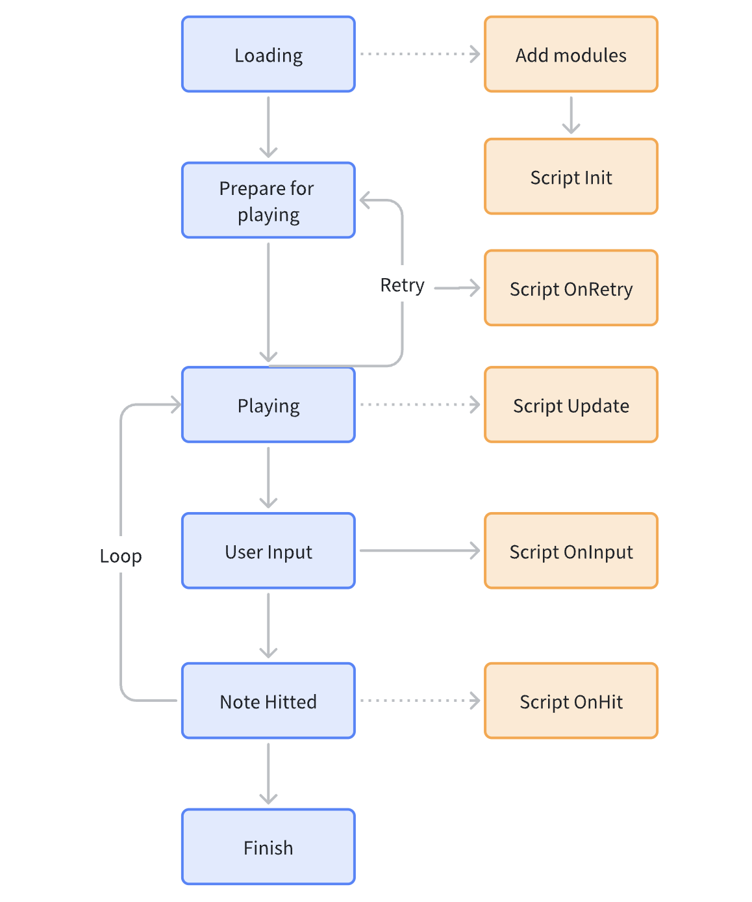

# スキンスクリプトAPI - 基礎編

## 利用シーン

MalodyV 5.3.0 から、スキンシステムは以下のような機能を持つスクリプトの組み込みがサポートされるようになりました。

1. ゲームプレイ前に (端末の情報に基づいてサイズや位置などを動的に計算するなど) スキンの要素の状態を動的に変更する。個々の要素にアニメーションを設定する。
2. ゲームプレイ中、各フレームでスキンの要素の状態を動的に変更する。
3. 画面のタッチや、キー入力、ノーツの判定のタイミングをトリガーにして、スキンの要素の状態を動的に変更する。


## データ構造

### モジュール

スキン内の要素やオブジェクトはモジュール (Module) と呼ばれ、サイズや位置、色などを含む全ての属性を含んでいます。

### アニメーション

スクリプトでは、以下のような構造のデータを使用してアニメーションを記述します。

```lua
{
    start = 1000,  -- 開始時間 (単位: ミリ秒)
    finish = 2000,  -- 終了時間 (単位: ミリ秒)
    from = 50,  -- 開始時点の値
    to = 100, -- 終了時点の値
    repeats = 2,  -- 繰り返し回数, 任意
    repeatType = 1,  -- 繰り返し方法 *1
    delay = 0, -- 繰り返し間の待機時間, 任意
    ease = 1, -- イージング *2
    custom = {p1=1,p2=0,p3=1,p4=-0.77}  -- カスタムイージング, 任意
}
```
*1 [繰り返し方法](#繰り返し方法), *2 [イージングの種類](#イージングの種類) 

### イージング

組み込みのイージング値 (Easein, Easeout) を使用せずに、カスタム値を自分で設定することも出来ます。

オンラインツール: [http://cubic-bezier.com/](http://cubic-bezier.com/) を使ってお好みの動きを作成し、画面に出力された値をイージングのパラメータ (p1 ~ p4) にコピー&ペーストすることをおすすめします。

カスタムイージングは、4つの値を持つ構造のデータで記述します。

```lua
{p1=1, p2=0, p3=1, p4=-0.77}
```

### BPM

BPMは「time: 開始時刻」と「bpm: BPM値」を含む以下のような構造のデータで記述します。

```lua
{
    time = 0,
    bpm = 160
}
```

## テンプレート

```lua
-- プレイ開始前に呼び出されます。
function Init()
end

-- 毎フレーム呼び出されます。
function Update()
end

-- プレイヤーがノーツを叩いた際に呼び出されます。
-- Composer でのプレビュー中には呼び出されません。
function OnHit()
end

-- プレイヤーがキーを入力したりスクリーンをタッチした際に呼び出されます。
-- Composer でのプレビュー中には呼び出されません。
function OnInput()
end
```

## API リファレンス

以下のAPIは MalodyV 5.3.0 からサポートされています。

### モジュール管理API
> 例: local light = Module:Find("light")

| lua関数名                                 | 概要                                                                                                              | 備考                                                                                                                                                                         |
| ----------------------------------------- | ----------------------------------------------------------------------------------------------------------------- | ---------------------------------------------------------------------------------------------------------------------------------------------------------------------------- |
| Find(string): module                      | モジュールを検索します。<br>----<br> string: 検索したいモジュールの名前                                           | Composer で設定した名前をパラメータに指定します。                                                                                                                            |
| [+ 5.3.4 +] Clone(module, string): module | モジュールの複製を作成します。<br>----<br> module: 複製元のモジュール<br> string: 新しいモジュール名              | Init() 関数内でのみ使用することが出来ます。<br> ※他の関数から複製したモジュールを参照するには Find() 関数を使用します。 <br> Composer 上では複製元のモジュールが返されます。 |
| [+ 5.3.4 +] Shadow(module, int): module   | モジュールのシャドウ (生存期間付きの複製) を作成します。<br>----<br> module: 複製元のモジュール<br> int: 生存期間 | Init() 関数以外でも使用することが出来ます。<br> Composer 上では複製元のモジュールがそのまま返されます。                                                                      |
| [+ 5.4.0 +] GetString(string): string     | Composer で定義したスクリプト変数 (文字列) を取得します。                                                         | デフォルトでは空文字が返されます。                                                                                                                                           |
| [+ 5.4.0 +] GetNumber(string): float      | Composer で定義したスクリプト変数 (数値) を取得します。                                                           | デフォルトでは 0 が返されます。                                                                                                                                              |
| [+ 5.4.0 +] GetBool(string): bool         | Composer で定義したスクリプト変数 (Bool値) を取得します。                                                         | デフォルトでは false が返されます。                                                                                                                                          |

### モジュール属性
> 例: light.X = 100

| 属性名             | 概要                             | 備考                                                                                                                                |
| ------------------ | -------------------------------- | ----------------------------------------------------------------------------------------------------------------------------------- |
| X                  | X座標 (単位: unit)               |                                                                                                                                     |
| Y                  | Y座標 (単位: unit)               |                                                                                                                                     |
| Width              | 幅 (単位: unit)                  |                                                                                                                                     |
| Height             | 高さ (単位: unit)                |                                                                                                                                     |
| Rotate             | Z軸 (スクリーン) 方向の角度      | int (正の値は時計回りを表します。)                                                                                                  |
| RotateX            | X軸方向の角度                    | int                                                                                                                                 |
| RotateY            | Y軸方向の角度                    | int                                                                                                                                 |
| Alpha              | 透明度 [0-100]                   | int                                                                                                                                 |
| Text               | テキスト                         | テキストモジュールのみサポートされます。                                                                                            |
| [+ 5.3.4 +] ScaleX | X方向の縮尺                      |                                                                                                                                     |
| [+ 5.3.4 +] ScaleY | Y方向の縮尺                      |                                                                                                                                     |
| [+ 6.0.0 +] Scale  | 縮尺                             |                                                                                                                                     |
| [+ 6.2.2 +] Value  | マスク画像の塗りつぶし値 [0-100] | 0 ... 表示されていない状態を表す<br> 50 ... 画像が半分だけ表示されている状態を表す<br> 100 ... 画像が完全に表示されている状態を表す |

*unit単位: スクリーンの高さを 1080 とした際の相対的な数値

### モジュール関数
> 例: light:DoMoveX({start=1000, end=2000, from=0, to=100})

| lua関数名                                      | 概要                                                             | 備考                                                                                                                                                                  |
| ---------------------------------------------- | ---------------------------------------------------------------- | --------------------------------------------------------------------------------------------------------------------------------------------------------------------- |
| Play()                                         | フレームアニメーションを再生します。                             |                                                                                                                                                                       |
| Stop()                                         | フレームアニメーションを停止し, 最初のシーケンス画像に戻します。 | 停止後にモジュールを非表示にするには Alpha の値を 0 に変更する必要があります。                                                                                        |
| DoMove(animate, animate):id                    | 移動するアニメーションを追加します。                             | 1つ目のパラメータは水平移動のアニメーション, 2つ目のパラメータは垂直移動のアニメーションを表します。2つ目のパラメータに関しては from と to を省略することが出来ます。 |
| DoMoveX(animate):id                            | 水平方向に移動するアニメーションを追加します。                   |                                                                                                                                                                       |
| DoMoveY(animate):id                            | 垂直方向に移動するアニメーションを追加します。                   |                                                                                                                                                                       |
| DoResize(animate, animate):id                  | サイズを変更するアニメーションを追加します。                     | 1つ目のパラメータは幅変更のアニメーション, 2つ目のパラメータは高さ変更のアニメーションを表します。2つ目のパラメータに関しては from と to を省略することが出来ます。   |
| DoWidth(animate):id                            | 幅を変更するアニメーションを追加します。                         |                                                                                                                                                                       |
| DoHeight(animate):id                           | 高さを変更するアニメーションを追加します。                       |                                                                                                                                                                       |
| DoAlpha(animate):id                            | 透明度を変更するアニメーションを追加します。                     |                                                                                                                                                                       |
| DoRotate(animate):id                           | 回転するアニメーションを追加します。                             |                                                                                                                                                                       |
| [+ 6.0.0 +] DoRotateX(animate):id              | X軸を中心に回転するアニメーションを追加します。                  |                                                                                                                                                                       |
| [+ 6.0.0 +] DoRotateY(animate):id              | Y軸を中心に回転するアニメーションを追加します。                  |                                                                                                                                                                       |
| [+ 5.3.4 +] DoScale(animate, animate):id       | 縮尺を変更するアニメーションを追加します。                       |                                                                                                                                                                       |
| [+ 5.3.4 +] DoScaleX(animate):id               | X方向の縮尺を変更するアニメーションを追加します。                |                                                                                                                                                                       |
| [+ 5.3.4 +] DoScaleY(animate):id               | Y方向の縮尺を変更するアニメーションを追加します。                |                                                                                                                                                                       |
| [+ 5.3.4 +] SetColor(r, g, b)                  | 色を変更するアニメーションを追加します。                         |                                                                                                                                                                       |
| [+ 5.4.62 +] CancelAnimate(id)                 | アニメーションを停止します。                                     |                                                                                                                                                                       |
| [+ 6.0.0 +] SetSlice(left, top, right, bottom) | 9Sliceを適用します。                                             | 9Sliceを適用すると, 指定した領域内のみに拡大縮小が適用されるようになります。                                                                                          |

### ヒットイベント
> 例: local hit = Game:HitEvent()
> hit:JudgeResult()

| lua関数名                          | 概要                                                                                                                                                                                                                                                                | 備考                                                  |
| ---------------------------------- | ------------------------------------------------------------------------------------------------------------------------------------------------------------------------------------------------------------------------------------------------------------------- | ----------------------------------------------------- |
| JudgeResult(): int                 | ヒットしたノーツの判定結果を取得します。                                                                                                                                                                                                                            | [参照](#ノーツヒット時の判定)                         |
| Offset(): int                      | ヒットした時間とノーツの本来の判定時間とのズレ (オフセット) を取得します。                                                                                                                                                                                          | 正の値の場合は早ズレ,負の値の場合は遅ズレを表します。 |
| HitX(): int                        | ヒットしたノーツのX座標を取得します。                                                                                                                                                                                                                               |                                                       |
| [+ 5.3.2 +] NoteTime(): int        | ヒットしたノーツの判定時間を取得します。                                                                                                                                                                                                                            |                                                       |
| [+ 5.3.2 +] NoteWidth(): int       | ヒットしたノーツの幅を取得します。                                                                                                                                                                                                                                  | Slide 以外のモードでは 0 が返されます。               |
| [+ 5.3.4 +] NoteType(): int        | ヒットしたノーツの種類を取得します。                                                                                                                                                                                                                                | [参照](#ノーツの種類)                                 |
| [+ 5.4.32 +] NoteInfo(string): int | ノーツの追加情報を取得します。<br>----<br> パラメータ名<br> Arrow: フリック方向 ([参照](#フリック方向))<br>[+ 5.4.52 +] Hit: Taiko モードにおける Renda/Balloon ノーツのヒット回数<br> [+ 5.4.52 +] Remain: Taiko モードにおける Renda/Balloon ノーツの残ヒット回数 | 大文字と小文字は区別されません。                      |

### 入力イベント
> 例: local hit = Game:InputEvent()
> hit:HitX()

| lua関数名                 | 概要                                                                                          | 備考                                                                     |
| ------------------------- | --------------------------------------------------------------------------------------------- | ------------------------------------------------------------------------ |
| [+ 5.3.2 +] HitX(): int   | X座標 または トラックの位置 を取得します。                                       | 入力イベントが発生した位置がプレイフィールド外の場合は -1 が返されます。 |
| [+ 6.0.0 +] HitY(): int   | Y座標を取得します。                                                                           |                                                                          |
| [+ 5.3.2 +] Type(): int   | 入力の種類を取得します。                                                                      | [参照](#入力の種類)                                                      |
| [+ 5.3.4 +] Source(): int | タッチした指を表すIDを返します。 (同じIDが返された場合は同じ指であると判断することが出来ます) | タッチではなくキーボードで入力された場合は -1 が返されます。             |

### オーディオAPI
> 例: Audio:Load("hit.ogg")

| lua関数名                    | 概要                                                                                                          | 備考                                        |
| ---------------------------- | ------------------------------------------------------------------------------------------------------------- | ------------------------------------------- |
| [+ 6.0.0 +] Load(name): res  | スキンフォルダ内にあるオーディオファイルを読み込み, リソースID (res) を返します。                             | サポートされているフォーマット: mp3,ogg,wav |
| [+ 6.3.32 +] Load(name): res | 譜面フォルダ内にあるオーディオファイルを読み込み, リソースID (res) を返します。                               | サポートされているフォーマット: mp3,ogg,wav |
| [+ 6.0.0 +] Play(res, vol)   | 指定されたリソースIDのオーディオを再生し, 音量を設定します。<br>---<br>res: リソースID<br> vol: 音量, [0-100] |                                             |

### ゲーム管理API
> 例: local w = Game:Width()

| lua関数名                                    | 概要                                                                                                                                                                                                                                               | Remarks                                                                        |
| -------------------------------------------- | -------------------------------------------------------------------------------------------------------------------------------------------------------------------------------------------------------------------------------------------------- | ------------------------------------------------------------------------------ |
| AudioLength(): int                           | 楽曲の合計時間を取得します。 (単位: ミリ秒)                                                                                                                                                                                                        | Composer 上では 60000 が返されます。                                           |
| Time(): int                                  | 現在の経過時間を取得します。 (単位: ミリ秒)                                                                                                                                                                                                        | Composer 上では 0 から 60000 の間の時間が返されます。                          |
| HitEvent(): hit                              | 現在発生しているヒットイベントを取得します。                                                                                                                                                                                                       | 通常は OnHit() 関数の中で使用します。<br> Composer 上では null が返されます。       |
| Width():int                                  | スクリーンの幅を取得します。 (単位: unit)                                                                                                                                                                                                          |                                                                                |
| Height(): int                                | スクリーンの高さを取得します 。(単位: unit)                                                                                                                                                                                                        | デフォルトで 1080 が返されます。                                               |
| [- 5.4.62 -] TrackAngle(): int               | トラックの傾斜角を取得します。                                                                                                                                                                                                                     | ※ FieldMeta に統合されたため現在は使用出来ません。                             |
| [+ 5.3.1 +] StartTime(): int                 | 一番最初のノーツが判定される時間をミリ秒単位で取得します。                                                                                                                                                                                         | Composer 上では 1000 が返されます。                                            |
| [+ 5.3.1 +] BpmCount(): int                  | BPM変化の回数を取得します。                                                                                                                                                                                                                        | Composer 上では 1 が返されます。                                               |
| [+ 5.3.1 +] BpmAt(int): bpm                  | 指定された のBPM情報を取得します。                                                                                                                                                                                                                 | インデックスは 0 から BpmCount-1 まで, <br> Composer 上では bpm=160 が返されます。  |
| [+ 5.3.2 +] InputEvent(): input              | 現在発生している入力イベントを取得します。                                                                                                                                                                                                         | 通常は OnInput() 関数の中で使用します。<br> Composer 上では null が返されます。     |
| [+ 5.3.4 +] [- 5.4.62 -] SceneScale(): float | プレイフィールドのスケール値を取得します。                                                                                                                                                                                                         | ※ FieldMeta に統合されたため現在は使用出来ません。                             |
| [+ 5.4.0 +] IsVersionGE(int, int, int): bool | 現在のバージョンが指定されたバージョン以上かどうかを取得します。                                                                                                                                                                                   |                                                                                |
| [+ 5.4.32 +] ChartInfo(string): string       | 譜面の情報を取得します。<br>----<br> パラメータ名<br>Version: string<br> Creator: string<br> Title: string<br> Artist: string<br> Bpm: number<br> Level: number<br> [+ 5.4.52 +] Key: number, キーの数<br> [+ 5.4.52 +] Note: number, ノーツの総数 | 大文字と小文字は区別されません。<br> Composer 上では空文字が返されます。            |
| [+ 5.4.62 +] FieldMeta(string): number       | プレイフィールドの情報を取得します。<br>----<br> パラメータ名<br> Angle: トラックの傾斜角<br> Scale: プレイフィールドのスケール値<br> Judge: 判定位置<br> JudgeY: Taiko モードの判定位置の高さ                                                     |                                                                                |
| [+ 5.4.62 +] SetFieldMeta(string, number)    | プレイフィールドの情報を変更します。                                                                                                                                                                                                               | 設定値が Composer の設定パネル上でロックされている場合は値を変更出来ません。   |
| [+ 6.0.0 +] ReadFile(name): string           | スキン, または譜面フォルダ内にあるファイルから文字列を読み込みます。                                                                                                                                                                               | 最初にスキンフォルダ内から検索し, 見つからなければ譜面フォルダ内を検索します。 |
| [+ 6.0.0 +] Language(): int                  | システム言語を取得します。                                                                                                                                                                                                                         | [参照](#システム言語)                                                          |
| [+ 6.0.42 +]ReadBytes(name):array            | スキン, または譜面フォルダ内にあるファイルからバイナリ情報を読み込みます。                                                                                                                                                                         |                                                                                |

## 定義済みの値

### イージングの種類

Normal = 0

Ease In = 1

Ease Out = 2

### 繰り返し方法

Normal = 1，アニメーション終了後、最初の位置から再び変化が開始します。

Round = 2，アニメーション終了後、元の位置に戻るように変化します。

### ノーツヒット時の判定

Ignore = 0

Best = 1

Cool = 2

Good = 3

Miss = 4

Flick = 5

[+ 5.3.1 +] Hold Combo = 6

[+ 5.3.4 +] Wipe = 7

[+ 5.4.6 +] Combo Break = 8

[+ 5.4.40 +] Taiko Big Hit Best = 9

[+ 5.4.40 +] Taiko Big Hit Cool = 10

[+ 5.4.40 +] Taiko Renda = 11

[+ 5.4.40 +] Taiko Balloon Hit = 12

[+ 5.4.40 +] Taiko Balloon Pop = 13

### 入力の種類

Down = 1

Move = 2

Up = 3

### ノーツの種類

Tap = 1

Hold = 2

Rain = 3

Wipe = 4

Flick(Tap) = 5

Flick(Wipe) = 6

Slide = 7

[+ 5.4.40 +] Taiko Don = 8

[+ 5.4.40 +] Taiko Big Don = 9

[+ 5.4.40 +] Taiko Ka = 10

[+ 5.4.40 +] Taiko Big Ka = 11

[+ 5.4.40 +] Taiko Renda = 12

[+ 5.4.40 +] Taiko Big Renda = 13

[+ 5.4.40 +] Taiko Balloon = 14

[+ 6.0.0 +]Osu Slider = 15

[+ 6.0.0 +]Osu Spinner = 16

### フリック方向

Left = 1

Up = 2

Right = 3

### システム言語

0 = English

1 = 简体中文(Chinese Simplified)

2 = 繁體中文(Chinese Traditional)

3 = 日本語 (Japanese)

4 = Español(Spanish)

5 = Deutsch(German)

6 = ไทย(Thai)

7 = Русский(Russian)

8 = Français(French)

9 = 한국어(Korean)

10 = Български(Bulgarian)

11 = Bahasa indonesia(Indonesian)

12 = Italiano(Italian)

13 = Tiếng Việt(Vietnamese)

14 = Українська(Ukrainian)

## デモ

```lua
function Init()
    local marlo = Module:Find(marlo)
    -- モジュールにアニメーションを追加します。
    local ease = {p1=1, p2=0, p3=1, p4=-0.77}
    marlo:DoMove({start=1000, finish=2000, from=100, to=200, custom=ease})
    marlo:DoAlpha({start=1000, finish=2000, to=100}) -- from が省略された場合, デフォルトは 0 が設定されます。
end

function Update()
    local time = Game:AudioTime()
    local marlo = Module:Find(marlo)
    marlo.Alpha = time / Game:AudioLength()
end
    
function OnHit()
    local evt = Game:HitEvent()
    local judge = evt:JudgeResult()
   
    if (judge == 0) then
        local judge_text = Module:Find(judge-1)
        judge_text:Play()
    elseif (judge == 1) then
        local judge_text = Module:Find(judge-2)
        judge_text:Play()
    elseif (judge == 2) then
        local judge_text = Module:Find(judge-3)
        judge_text:Play()
    else
        local judge_text = Module:Find(judge-4)
        judge_text:Play()
    end
end
```
