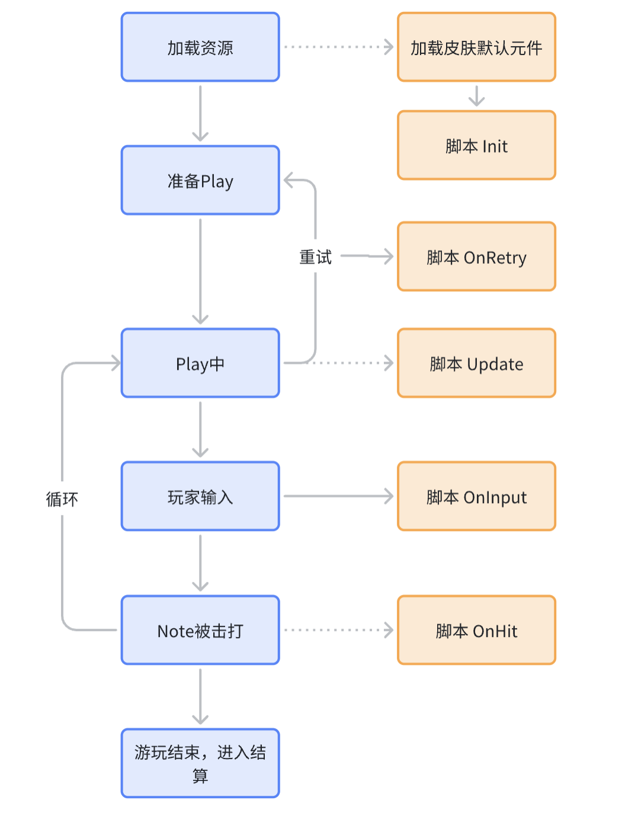

# 皮肤脚本文档

## 使用场景

自 MalodyV 5.3.0 开始，皮肤系统支持配合脚本使用，可以实现以下功能：

1. 在皮肤初始化时，动态修改元件所有属性（例如根据设备属性动态计算尺寸，位置等）。为元件设置动画。
2. 在游玩全程每一帧动态修改元件部分属性。
3. 在玩家进行击打时，动态修改元件部分属性。

## 数据说明

### 元件

在皮肤中，每一个独立对象被称为元件，元件包含了对象的图像素材，尺寸，位置，颜色等全部属性。元件在 API 的传参和返回值中以 module 指代。

### 动画

描述一个元件的一个动作过程被称为动画，在脚本中动画是一个结构体，在后续文档中用 animate 指代这个结构体。结构如下：

```lua
{
    start = 1000,  -- 开始的音频时间
    finish = 2000,  -- 结束的音频时间
    from = 50,  -- 动画开始前的值
    to = 100, -- 动画结束后的值
    repeats = 2,  -- 重复次数，0代表不重复，可选
    repeatType = 1,  -- 重复方向，定义见下方枚举，可选
    delay = 0,  -- 重复之前等待的时间，毫秒，可选，5.3.2起
    ease = 1, -- 缓动效果，定义参见下文枚举定义，可选
    custom = {p1=1,p2=0,p3=1,p4=-0.77}  -- 自定义缓动，可选
}
```

对应 DoMove 和 DoResize 两个需要一次改变 2 个值的 API，传值方式有特殊约定，下文有详细描述。

### 自定义缓动

如果不使用内置缓动，可以自己设置缓动效果。自定义缓动需要 4 个值，建议使用在线工具：[http://cubic-bezier.com/](http://cubic-bezier.com/) 调试出想要的效果，再把工具输出的值写到缓动的 p1~p4 参数上。

可以使用变量保存缓动值，以便复用给其他动画。

结构如下：

```lua
{p1=1,p2=0,p3=1,p4=-0.77}
```

### BPM

描述一个 BPM 记录，包含开始时间和 BPM 值，在后续文档中用 bpm 指代这个结构体。

结构如下：

```lua
{
    time = 0,
    bpm = 160
}
```

## 脚本模板

```lua
-- 皮肤初始化时被调用
function Init()
end

-- 每一帧调用。函数为空时删除函数
function Update()
end

-- 玩家击打时调用。函数为空时删除函数
-- 在Composer中不会被调用
function OnHit()
end

-- 玩家操作时调用，按键，抬起等。函数为空时删除函数
-- 在Composer中不会被调用
function OnInput()
end
```

## 接口文档

以下接口没有特别指定的，都是从客户端 5.3.0 版本开始支持

### 模块接口
> 使用示例：local light = Module:Find("light")

| lua 函数名                              | 定义                                               | 备注                                                                                  |
| --------------------------------------- | -------------------------------------------------- | ------------------------------------------------------------------------------------- |
| Find(string): module                    | 查找元件，传入参数是在 Composer 面板上填入的元件名 |                                                                                       |
| [+ 5.3.4 +]Clone(module, string): module | 复制一个元件，传入元件实例，并设置新元件名。       | 元件名不能重名，仅在 Init 中可调用。可以通过新名称查找元件。Composer 中返回元件自身。 |
| [+ 5.3.4 +]Shadow(module, int): module   | 创建一个元件的影子对象，设置存活时间（毫秒）       | 不限制调用，元件只保证从创建开始到指定存活时间内有效。Composer 中返回元件自身。       |
| [+ 5.4.0 +]GetString(string): string     | 访问 Composer 中预先定义的字符值                   | 默认返回空                                                                            |
| [+ 5.4.0 +]GetNumber(string): float      | 访问 Composer 中预先定义的数字值                   | 默认返回 0                                                                            |
| [+ 5.4.0 +]GetBool(string): bool         | 访问 Composer 中预先定义的开关值                   | 默认返回 false                                                                        |

### 元件属性
> 使用示例：light.X = 100

| 属性名           | 定义                                    | 备注         |
| ---------------- | --------------------------------------- | ------------ |
| X                | X 坐标的单位值                          |              |
| Y                | Y 坐标的单位值                          |              |
| Width            | 宽度的单位值                            |              |
| Height           | 高度的单位值                            |              |
| Rotate           | 绕 Z 轴(屏幕平面)旋转角度，正值为顺时针 | 整型         |
| RotateX          | 绕 X 轴旋转值，正值为顺时针             | 整型         |
| RotateY          | 绕 Y 轴旋转值，正值为顺时针             | 整型         |
| Alpha            | 透明度，取值 0-100                      | 整型         |
| Text             | 文本                                    | 仅文本元件有 |
| [+ 5.3.4 +]ScaleX | X 方向缩放                              |              |
| [+ 5.3.4 +]ScaleY | Y 方向缩放                              |              |
| [+ 6.0.0 +]Scale  | 同时缩放 X 和 Y 方向                    |              |
| [+ 6.2.2 +]Value  | 遮罩图的填充值                    |              |

### 元件接口
> 使用示例：light:DoMoveX({start=1000, end=2000, from=0, to=100})

| lua 函数名                                   | 定义                                 | 备注                                                                                                                             |
| -------------------------------------------- | ------------------------------------ | -------------------------------------------------------------------------------------------------------------------------------- |
| Play()                                       | 用于帧动画元件，从头开始播放         |                                                                                                                                  |
| Stop()                                       | 用于帧动画元件，停止播放，显示第一帧 | 需要停止后隐藏，需要配合设置 Alpha = 0                                                                                           |
| DoMove(animate, animate):id                  | 添加移动动画                         | 传入 2 个 animate 参数，第一个代表 X 方向动画，第二个代表 Y 方向动画。第二个 aniamte 参数只需要填写 from&to 值。其他值会被忽略。 |
| DoMoveX(animate):id                          | 添加水平移动动画                     |                                                                                                                                  |
| DoMoveY(animate):id                          | 添加垂直移动动画                     |                                                                                                                                  |
| DoResize(animate, animate):id                | 添加尺寸变化动画                     | 传入 2 个 animate 参数，第一个代表宽度动画，第二个代表高度动画。第二个 aniamte 参数只需要填写 from&to 值。其他值会被忽略。       |
| DoWidth(animate):id                          | 添加宽度变化动画                     |                                                                                                                                  |
| DoHeight(animate):id                         | 添加高度变化动画                     |                                                                                                                                  |
| DoAlpha(animate):id                          | 添加透明度变化动画                   |                                                                                                                                  |
| DoRotate(animate):id                         | 添加旋转动画                         |                                                                                                                                  |
| [+ 6.0.0 +]DoRotateX(animate):id              | 添加绕 X 轴旋转动画                  |                                                                                                                                  |
| [+ 6.0.0 +]DoRotateY(animate):id              | 添加绕 Y 轴旋转动画                  |                                                                                                                                  |
| [+ 5.3.4 +]DoScale(animate, animate):id       | 添加缩放动画                         |                                                                                                                                  |
| [+ 5.3.4 +]DoScaleX(animate):id               | 添加 X 方向缩放动画                  |                                                                                                                                  |
| [+ 5.3.4 +]DoScaleY(animate):id               | 添加 Y 方向缩放动画                  |                                                                                                                                  |
| [+ 5.3.4 +]SetColor(r, g, b)                  | 设置元件颜色，rgb 取值 0-255         |                                                                                                                                  |
| [+ 5.4.62 +]CancelAnimate(id)                 | 取消指定动画                         |                                                                                                                                  |
| [+ 6.0.0 +]SetSlice(left, top, right, bottom) | 设置图片的 9 宫格拉伸区域            |                                                                                                                                  |

### 打击事件接口
> 使用示例：hit = Game:HitEvent()
> result = hit:JudgeResult()

| lua 函数名                       | 定义                                                                                                                                   | 备注                     |
| -------------------------------- | -------------------------------------------------------------------------------------------------------------------------------------- | ------------------------ |
| JudgeResult(): int               | 打击判定结果，返回值参考枚举定义                                                                                                       |                          |
| Offset(): int                    | 打击时刻与 Note 时间的偏差                                                                                                             | 正数，打早。负数，打晚   |
| HitX(): int                      | 打击 Note 的 X 坐标                                                                                                                    |                          |
| [+ 5.3.2 +]NoteTime(): int        | 打击 Note 的正确打击时间                                                                                                               |                          |
| [+ 5.3.2 +]NoteWidth(): int       | 打击 Note 的宽度                                                                                                                       | Slide 之外的 Note 返回 0 |
| [+ 5.3.4 +]NoteType(): int        | 打击 Note 的类型                                                                                                                       | 参考枚举定义             |
| [+ 5.4.32 +]NoteInfo(string): int | 获取额外 Note 信息<br>----<br> Arrow：Note 箭头方向<br> [+ 5.4.52 +]Hit: Taiko 连击 Note 的打击数<br> [+ 5.4.52 +]Remain: Taiko 连击 Note 的剩余打击数 | 参数不区分大小写         |

### 输入事件接口
> 使用示例：hit = Game:InputEvent()
> x = hit:HitX()

| lua 函数名              | 定义                                               | 备注             |
| ----------------------- | -------------------------------------------------- | ---------------- |
| [+ 5.3.2 +]HitX(): int   | 输入对应的 X 坐标或 X 映射                         | 打击区之外返回-1 |
| [+ 6.0.0 +]HitY(): int   | 输入对应的 Y 坐标                                  |                  |
| [+ 5.3.2 +]Type(): int   | 输入事件，参见枚举定义                             |                  |
| [+ 5.3.4 +]Source(): int | 输入来源，通常是手指的编号，相同数字代表同一根手指 | -1 表示来自键盘  |

### 音效接口
> 使用**Audio:** 访问 

| lua 函数名                | 定义                                                                     | 备注                  |
| ------------------------- | ------------------------------------------------------------------------ | --------------------- |
| [+ 6.0.0 +]Load(name): res | 加载一个位于皮肤目录下的音频资源，返回资源 id:res                        | 支持 mp3,ogg,wav 格式 |
| [+ 6.0.0 +]Play(res, vol)  | 播放指定资源 id 的音频，可设置音量 vol<br>---<br>res: 资源 idvol: 音量， [0-100] |                       |

### 辅助接口
> 使用**Game:** 访问 

| lua 函数名                                 | 定义                                                                                                                                                                                   | 备注                                                               |
| ------------------------------------------ | -------------------------------------------------------------------------------------------------------------------------------------------------------------------------------------- | ------------------------------------------------------------------ |
| AudioLength(): int                         | 获取音乐总时长（最后一个 Note 结束时间），单位毫秒，                                                                                                                                   | 在 Composer 中固定返回 60000                                       |
| Time(): int                                | 获取当前游玩开始的持续时间，单位毫秒                                                                                                                                                   | 在 Composer 中模拟从 0-60000ms                                     |
| HitEvent(): hit                            | 获取当前触发的打击事件                                                                                                                                                                 | 无法在 Composer 中使用                                             |
| Width():int                                | 游戏窗口宽度，返回单位值                                                                                                                                                               |                                                                    |
| Height(): int                              | 游戏窗口高度，返回单位值                                                                                                                                                               | 目前固定返回 1080，不排除未来版本会修改                            |
| [- 5.4.62 -]TrackAngle(): int               | 获取 Key 轨道倾斜角                                                                                                                                                                    | 仅 Key 和 Slide 模式可用，其他模式返回 0，未开启 3D 轨道时也返回 0 |
| [+ 5.3.1 +]StartTime(): int                 | 第一个 Note 的判定时间                                                                                                                                                                 | 在 Composer 中固定返回 1000                                        |
| [+ 5.3.1 +]BpmCount(): int                  | 获取谱面 bpm 个数                                                                                                                                                                      | 在 Composer 中固定返回 1                                           |
| [+ 5.3.1 +]BpmAt(int): bpm                  | 获取指定序号的 bpm 值                                                                                                                                                                  | 序号范围是 0 到 BpmCount-1，在 Composer 中固定返回 bpm=160         |
| [+ 5.3.2 +]InputEvent(): input              | 获取当前触发的输入事件                                                                                                                                                                 | 无法在 Composer 中使用                                             |
| [+ 5.3.4 +][- 5.4.62 -]SceneScale(): float   | 场景缩放值                                                                                                                                                                             | 与 Play 面板的场景缩放值相同                                       |
| [+ 5.4.0 +]IsVersionGE(int, int, int): bool | 当前版本是否大于等于指定版本                                                                                                                                                           |                                                                    |
| [+ 5.4.32 +]ChartInfo(string): string       | 获取谱面信息<br>----<br> Version: string<br> Creator: string<br> Title: string<br> Artist: string<br> Bpm: number<br> Level: number<br> [+ 5.4.52 +]Key: number, Key 轨道数量<br> [+ 5.4.52 +]Note: number, Note 数量 | 参数不区分大小写 Composer 中返回空值                               |
| [+ 5.4.62 +]FieldMeta(string): number       | 获取游戏场景的可控属性（同游戏设置面板）<br>----<br> Angle: Key 轨道倾斜角<br> Scale: 场景缩放值<br> Judge: 判定位置<br> JudgeY：Taiko 的判定高度                                                       |                                                                    |
| [+ 5.4.62 +]SetFieldMeta(string, number)    | 设置游戏场景的可控属性，key 同 FieldMeta                                                                                                                                               | 如果属性值在面板上是锁定状态，则不可设置                           |
| [+ 6.0.0 +]ReadFile(name): string           | 读取皮肤或谱面目录下指定文件                                                                                                                                                           | 优先查找皮肤目录，其次谱面目录                                     |
| [+ 6.0.0 +]Language(): int                  | 获取当前系统语言                                                                                                                                                                       | 参见枚举-语言值                                                    |
| [+ 6.0.42 +]ReadBytes(name):array | 读取皮肤或谱面目录下指定文件的二进制内容 | |

## 各类枚举值

### 缓动效果

Normal = 0

Ease In = 1

Ease Out = 2

### 循环类型

Normal = 0，代表每次都从 from 变化到 to

Round = 1，代表 from-to-from 的往复

### 打击判定结果

Ignore = 0

Best = 1

Cool = 2

Good = 3

Miss = 4

Flick = 5

[+ 5.3.1 +]Hold Combo = 6

[+ 5.3.4 +]Wipe = 7

[+ 5.4.6 +]Combo Break = 8

[+ 5.4.40 +]Taiko 大打良 = 9

[+ 5.4.40 +]Taiko 大打可 = 10

[+ 5.4.40 +]Taiko 连打 = 11

[+ 5.4.40 +]Taiko 气球打击 = 12

[+ 5.4.40 +]Taiko 气球爆破 = 13

### 输入类型

Down = 1

Move = 2

Up = 3

### Note 类型

Tap = 1

Hold = 2

Rain = 3

Wipe = 4

Flick(Tap) = 5

Flick(Wipe) = 6

Slide = 7

[+ 5.4.40 +]Taiko Don = 8

[+ 5.4.40 +]Taiko Big Don = 9

[+ 5.4.40 +]Taiko Ka = 10

[+ 5.4.40 +]Taiko Big Ka = 11

[+ 5.4.40 +]Taiko Renda = 12

[+ 5.4.40 +]Taiko Big Renda = 13

[+ 5.4.40 +]Taiko Balloon = 14
[+ 6.0.0 +]Osu Slider = 15
[+ 6.0.0 +]Osu Spinner = 16

### Note 箭头方向

Left = 1

Up = 2

Right = 3

### 语言值

0 = English

1 = 简体中文

2 = 繁體中文

3 = 日本語

4 = Español(Spanish)

5 = Deutsch(German)

6 = ไทย(Thai)

7 = Русский(Russian)

8 = Français(French)

9 = 한국어(Korean)

10 = Български(Bulgarian)

11 = Bahasa indonesia(Indonesian)

12 = Italiano(Italian)

13 = Tiếng Việt(Vietnamese)

14 = Українська(Ukrainian)

## 主要 API 调用演示

```lua
function Init()
    local marlo = Module:Find("marlo")
    -- 在元件上设置动画属性
    local ease = {p1=1,p2=0,p3=1,p4=-0.77}
    marlo:DoMove({start=1000, finish=2000, from=100, to=200, custom=ease})
    marlo:DoAlpha({start=1000, finish=2000, to=100}) -- from 为0可以省略
end

-- 每帧调用
function Update()
    local time = Game:AudioTime()
    local marlo = Module:Find("marlo")
    marlo.Alpha = time / Game:AudioLength()
end
    
function OnHit()
    local evt = Game:HitEvent()
    local judge = evt:JudgeResult()
   
    if (judge == 0) then
        local judge_text = Module:Find("judge-1")
        judge_text:Play()
    elseif (judge == 1) then
        local judge_text = Module:Find("judge-2")
        judge_text:Play()
    elseif (judge == 2) then
        local judge_text = Module:Find("judge-3")
        judge_text:Play()
    else
        local judge_text = Module:Find("judge-4")
        judge_text:Play()
    end
end
```
