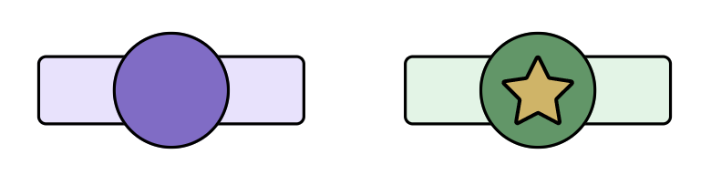
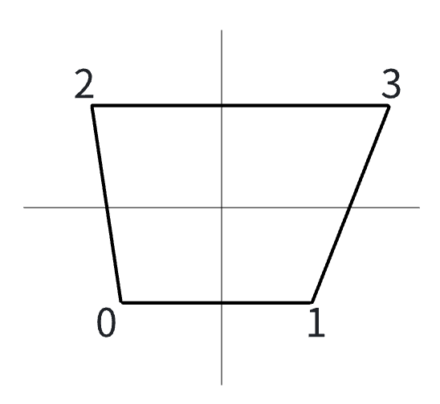

# 皮肤脚本文档-自由模式
## 使用场景
自MalodyV 6.0.0开始，皮肤系统开放自由模式：
1. 脚本控制每个Note外观。
2. 脚本控制每个Note的运动轨迹。
3. 脚本控制每个输入事件，进行判定，计分。

## 数据说明
### NoteInfo
记录Note数据，以下也简称info，结构如下：
```lua
{
    nid = 0,  -- note id，唯一标记
    group = 0,  -- note group
    type = 0,  -- 参见枚举 - Note类型
    time = 160,  -- 判定时刻
    endtime = 200,  -- hold类note的结束时间
    width = 40,
    arrow = 0,  -- 参见枚举 - Note箭头方向
    x = 1, -- Note x位置，从1开始
    y = 1, -- Note y位置，目前仅osu谱面使用
    repeats = 0, -- 往返次数，目前仅osu slider使用
    segments = list -- 片段数据
}

-- 片段数据，不同模式含义不同
-- slide：对应slide的片段信息，其中x和time都是相对头部的偏移量
-- catch：对应slider的路径信息，其中x和y是单位值
{
    x = 1,
    y = 1,
    time = 233  
}
```

### List
list对象与lua数组不同，区别如下：
```lua
-- 长度
list.Length
-- 元素
list[0]
```

## 脚本模板
```lua
-- 皮肤初始化时被调用，返回true/false表示是否支持当前谱面使用皮肤游玩
-- 可选，如果不需要过滤，可以不申明此函数
function CanPlay()
end

-- 在所有note解析之后，可以用此函数检查所有note，并添加虚拟note
-- 可选，如果不需要前处理，可以不申明此函数
function OnProcessNote()
end

-- Note即将出现之前调用
-- 必须存在此函数
function OnDrawNote(info)
end

-- 场面上所有可见Note每帧调用一次
-- note: 同OnDrawNote中的note参数
-- mod：与note绑定的module
-- percent：list，note每个部分(头，尾，中间节点)的位置值，0代表出现，1代表判定时刻
-- 必须存在此函数
function OnNoteMove(info, mod, percent)
end

-- 处理原始键盘输入，参数同OnInput
-- 可选，不需要处理原始键盘输入可不申明此函数
function OnKey()
end
```

## 接口文档
注意，下列所有接口均是自由模式特有接口。需要在Composer中打开自由模式开关后才可使用。使用自由模式皮肤的游玩目前不参与全球排名。
所有接口在Composer中都无法使用，不会报错。
**所有接口没有特别指定，都从6.0.0版本起。**

### 谱面接口
> 使用**Chart:** 接口访问
> 使用示例：notes = Chart:NoteCount()

| lua函数名 | 定义 | 备注 |
|- |- |-|
|ChartInfo(string): string| 获取谱面信息<br>---<br>version: string<br>creator: string<br>title: string<br>artist: string<br>bpm: string(number)<br>level: string(number)<br>key: string(number)，轨道数<br>note: string(number), note总数<br>od：string(number), 来自Osu谱的OD值<br>ar: string(number)，来自Osu谱的AR值<br>hp: string(number)，来自Osu谱的HP值<br>cs: string(number)，来自Osu谱的CS值<br>sm:  string(number)，来自Osu谱的SliderMultipler值<br>tick:  string(number)，来自Osu谱的TickRate值 | 参数不区分大小写<br>Composer中返回固定值 |
|NoteAt(int): info|获取指定序号的Note信息|序号范围是0到NoteCount-1，在Composer中所有字段都是0。|
|BpmCount(): int|获取谱面bpm个数|Composer中返回0|
|BpmAt(int): bpm|获取指定序号的bpm值|序号范围是0到BpmCount-1，在Composer中固定返回bpm=160|

### Note管理接口
> 使用**Note:** 访问 

| lua函数名 | 定义 | 备注 |
|- |- |-|
|AddVirtual(info)|仅支持在OnProcessNote中调用，添加一个虚拟note|含义解析见下文虚拟Note一节。
|GetNoteModule(name, group): module|仅支持在OnDrawNote中调用，设置当前Note的元件类型，Note元件是非标准module，不支持属性动画，参数是：<br>---<br>name：string, 元件类型名，**必填**<br>group：string, 指定元件整体的组(父容器)，**可选**|含义解析见下文Note元件一节。Note元件的坐标原点在屏幕中心。|
|GetGroup(name): module|获取指定名称的Note组容器，容器是标准module，支持属性动画|name对应对象不存在会自动创建。组容器的坐标原点在屏幕中心|

### 容器接口
> Note容器和父容器都可使用的接口，完全继承元件基础接口，此处是容器元件的特有接口

| lua函数名 | 定义 | 备注 |
|- |- |-|
|AddSprite(name, file, parent): module|向当前Note元件添加图像子节点，参数分别是：<br>---<br>name：string, 要添加的图像名，**必填**<br>file：string, 要添加的图像文件名，**必填**<br>parent：string, 可以指定添加的父级，**可选**|含义解析见下文Note元件一节|
|AddGrid(name, file, parent): module|向当前Note元件添加网格子节点，参数同AddSprite|Grid用法参见下文Grid使用一节|
|GetChild(name): module|获取子节点元件||

### Grid元件接口

| lua函数名 | 定义 | 备注 |
|- |- |-|
|SetVertex(index, x, y)|向Grid添加顶点|顶点定义用法参见下文Grid使用一节|

### Play接口
> 使用**Play:** 访问 

| lua函数名 | 定义 | 备注 |
|- |- |-|
|IsAuto(): bool|当前是否开了Auto||
|GetJudge(): int|返回当前判定，参见枚举-判定||
|SetScore(int)|设置当前总分||
|SetCombo(int)|设置当前combo||
|SetFullCombo(bool)|设置是否全连||
|SetAcc(float)|设置当前准确率，范围[0,100]||
|SetHP(float)|设置当前生命值，范围[0,100]||
|SetCountByType(judge, count)|设置原版4种判定的个数，参数：<br>judge: int, 判定类型, 见枚举-打击判定结果<br>count: int, 个数||
|SetFinish()|设置游玩结束，将跳转到内置结算界面||
|SetNoteFinish(nid)|设置Note已被判定||
|FindNoteByTime(lower, upper): info[]|查询当前时刻[lower, upper]范围的note，返回note info数组|仅查找当前可见范围，且不包含标记为finish的note|
|SetMissTime(int)|设置自动miss的时间，未被打击的note time低于当前时刻减去设置时间，自动判为miss||

### 打击事件接口
> 所有属性继承基础模式

| lua函数名 | 定义 | 备注 |
|- |- |-|
|NoteInfoEx(): info|返回完整note信息||

## 各类枚举值
### 判定
- Easy = 1
- Easy+ = 2
- Normal = 3
- Normal+ = 4
- Hard = 5
- Easy Pro = 11
- Easy+ Pro = 12
- Normal Pro = 13
- Normal+ Pro = 14
- Hard Pro = 15

## 概念解析
### 虚拟Note
在OnProcessNote接口中，通过调用AddVirtual(info)可以添加虚拟Note，虚拟Note具有普通Note完全相同的属性，通过可以用于以下用途：
- 将一个真实Note拆分成多个虚拟Note，实现某些效果（比如Catch模式把Rain类型拆分成若干的随机Note）
- 为一个真实Note添加用于演出效果的附属
- 效果Note
- 节拍线
- 跟随Note组容器运动的非Note元件，如判定线
虚拟Note虽然拥有和普通Note一样的属性，但属性具体值含义由脚本自行决定，比如note.width在普通Note里表示Note宽度，但脚本可以利用width属性保存演出效果类型等。在OnDrawNote中，根据自定义规则进行处理。


### Note元件
Note元件不是标准元件，可能是一个单张图片，或多个图片组合。一般一个谱面有数百到上千Note，每个Note都需要一个元件对应，但给每个Note都配对一个元件非常浪费内存，尤其是一张谱面中大部分Note都是同一个外观。为了提高性能，引擎内部实际会复用结构相同的Note元件。比如有如下2种元件：


左边元件由2张图组成，记为结构A。右边元件由3张图组成，记为结构B。一个元件要如何构成只有皮肤创作者知道，引擎并不能事前获知。为了让引擎更好的复用元件，需要脚本告知元件类型，比如如下代码：
```lua
function OnDrawNote(info)
    -- 根据Note类型设置容器
    if (info.type == 1) then
        root = Note:GetNoteModule("type-A")
    else
        root = Note:GetNoteModule("type-B")
    end
    Note:AddSprite("bg", "purple.png")
    ...
end
```
这段代码中，区分note类型设置了2种不同类型type-A和type-B，然后给不同类型配置不同的子元件。
这样好处是，当引擎需要复用元件时，会根据类型名称寻找，如果能找到就复用，否则创建新的。而被打击过的note对应的元件会进入复用池，供下次使用。这将极大提升Play运行时性能。

### Grid使用
当需要绘制非矩形元件，可以使用Grid，Grid可以自定义4个顶点的相对位置，进而可以构造出任意四边形。如下图所示：


坐标中心是Note的原点，四个顶点序号从0到3，位置如图。图中的形状可以由下面代码来构造：
```lua
root = Note:GetNoteModule("normal")
body = root:AddGrid("body", "note.png")
body:SetVertex(0, -100, -100)
body:SetVertex(1, 100, -100)
body:SetVertex(2, -120, 100)
body:SetVertex(3, 150, 100)
```
顶点可以在任意时刻修改，并且立即生效。但请注意，必须至少设置一次四个顶点的坐标，图形才会显示出来。并且如果设置的顶点坐标无法构成四边形，图形也不会显示。

### 计分
自由模式下，脚本可以自行计分，并使用各类元件进行分数显示，不需要跟随Malody内置的4判定(Best/Cool/Good/Miss)。如果想利用内置的结算来显示分数及细节，依然需要调用Score相关接口，进行分数设置。否则结算会显示全0分数。

## 主要API调用演示
```lua
-- 只兼容4K Key谱
function CanPlay()
    key = tonumber(Chart:ChartInfo("key"))
    if (key == 4) then
        return true
    else
        return false
    end
end

function OnDrawNote(info)
    if(info.type == 1) then
        -- 普通note是一个单图
        root = Note:GetNoteModule("normal")
        Note:AddSprite("bg", "note-1.png")
    else
        -- Hold有头，尾，身体组成，头部有个小星星装饰
        root = Note:GetNoteModule("hold")
        body = Note:AddSprite("bg", "note-2.png")
        head = Note:AddSprite("head", "note-2-head.png")
        rear = Note:AddSprite("rear", "note-2-rear.png")
        star = Note:AddSprite("star", "note-2-star.png", "head")
    end
end

function OnNoteMove(info, mod, p)
    -- note缩放从0开始，在打击时刻变成刚好1倍
    if (p[0] < 1) then
        mod.Scale = p[0]
    else
        mod.Scale = 1
    end
end
```

